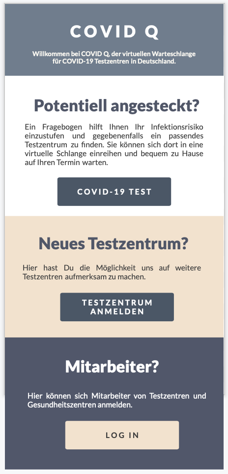
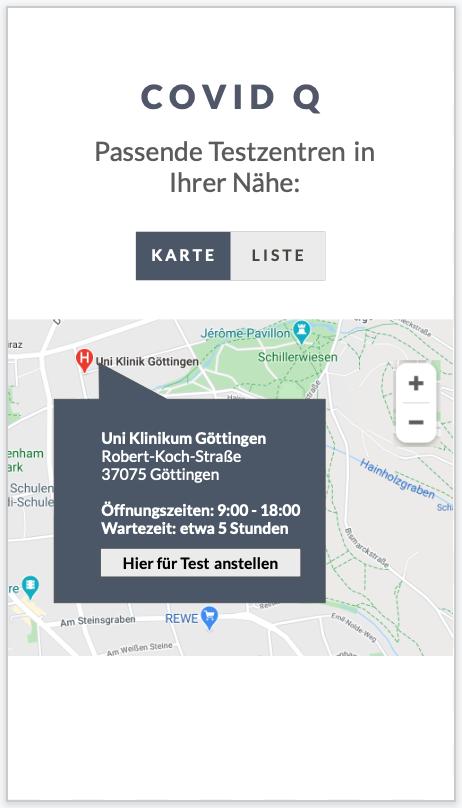
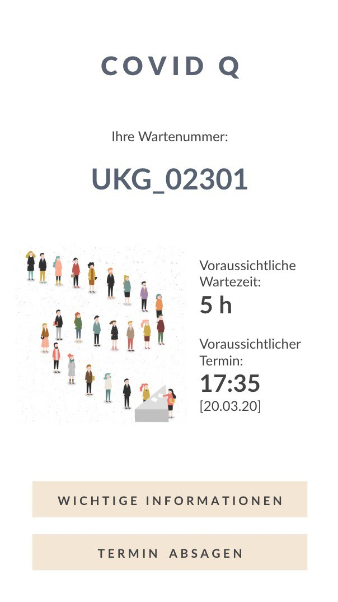

# COVID Q

Der hohe Bedarf an Tests auf SARS-CoV-19 führt zu überfüllten Teststellen mit teils drastischen Verspätungen und auflaufenden Menschenmassen. Des Weiteren ist der Prozess für Patient, Arzt und dem medizischen Personal sowohl aufwendig als auch bürokratisch. 

Unsere Plattform entlastet die Testzentren in Deutschland, indem Patienten unmittelbar vor dem Test zum Zentrum gerufen werden. Damit vermeiden wir lange Schlangen potentiell erkrankter Menschen. Auf Basis von Echtzeitdaten der Warteschlangen reagieren wir auch auf Verzögerungen im Testablauf und informieren die Patienten über etwaige Verspätungen. Damit erzeugen wir bedeutend weniger Aufwand als bei der klassichen Terminvergabe und sind untern Strich dennoch sicherer sowie flexibler.

|  	|  	|  |
|------------------------------------	|------------------------------------	|------------------------------------	|

## Ziele

### Identifizieren von Verdachtspersonen ohne Aufwand

Aufgrund der Omnipräsenz des SARS-CoV-19 Virus in den Medien haben viele Menschen die Angst, sie könnten sich mit dem Virus infiziert haben. Dabei informieren sich viele über den ärztlichen Bereitschaftsdienst unter **116117**, lokalen Beratungsstellen oder beim Arzt des Vertrauens. Die Anlaufstellen sind aufgrund der hohen Nachfrage maximal ausgelastet und Ärzte können im Fall anderer Beschwerden nicht mehr verlässlich kontaktiert werden.

Die Plattform **COVID Q** vermittelt Patienten mit Verdacht auf eine Infektion an die Testzentren in Deutschland. Dabei findet zunächst eine Eigen-Anamnese statt, wie sie auch durch eine telefonische Beratungsstelle oder den Arzt stattfindet. Auf Basis aktueller Empfehlungen vermittelt die Plattform Verdachtsfälle an qualifizierte Testzentren in der Nähe. Falls die Notwendigkeit auf einen Test aufgrund der Eigen-Anamnese nicht gegeben ist, werden Links zu öffentlichen Beratungstellen und Tipps zum Eigenschutz bereitgestellt. Damit sollen die Beratungsstellen und Ärzte entlastet und besorgte Menschen aufgeklärt werden.

### Unbürokratisch zum Test bei Verdacht

Im Falle eines begründeten Verdachtes auf eine Infektion mit SARS-CoV-19 - z.B. falls sich die Person in einem Risikogebiet befunden oder direkten Konakt mit einer positiv getesteten Person gehabt hat -, kann die betroffene Person sich auf die Warteliste eines Testzentrums setzen. Das Testzentrum erhält auch einen Zugang zur Plattform. Über diesen Zugang können die Wartelisten und auch die Daten zu den Patienten abgerufen werden. Das medizinische Personal kann Nachrichten an alle Patienten der Warteliste schicken und Informationsmaterialen wie zum Beispiel Anfahrtsbeschreibungen oder Verhaltensregeln veröffentlichen. Patienten haben mit **COVID Q** nur noch eine Anlaufstelle und müssen nicht stundenlang in Telefon-Warteschleifen verbringen. Die Daten werden zw. dem Testzentrum und dem Patienten direkt geteilt, sodass möglichst wenige Personin mit der Bearbeitung eines Falles beschäftigt sind.

Das medizinsche Personal des Testzentrums kann die Patienten auf der Warteliste prüfen und die Notwendigkeit auf einen Test in einer zweiter Instanz prüfen.

### Dynamische Terminvergabe

Die meisten Testzentren in Deutschland vergeben Termine und Verdachtsfälle auf das Virus zu testen. Das ist zum Einen mit einem hohen Bearbeitungsaufwand verbunden und zum Anderen unflexibel im Fall von Verzögerungen. Falls Termin auflaufen, stauen sich auch die Personen im Testzentrum, wodurch sich eine Gruppe potentiell ansteckender Personen bildet. 

Die Plattform erfasst den Bearbeitungsstatus aller in der Warteliste stehenden Patienten. Über Echtzeitdaten können die Patienten ihre geschätzte Wartedauer jederzeit einsehen und werden wenige Stunden vor dem Test informiert, sich zur Teststelle zu begeben. Damit werden auflaufenden Personengruppen vermieden und die Gefahr einer Ansteckung Anderer in vollen Wartezimmern reduziert. 

Wir glauben, dass dieses Konzept flexibler als die klassische Terminvergabe ist und durch permantente Transparenz keinen Nachteil für die Patienten bildet.

## FAQ

### Erhält jeder Patient in der Plattform einen Termin für einen Test?

Nein. Ein Ziel der Plattform ist die Identifizierung von begründeten Verdachtsfällen. Personen, bei denen auf Basis der Eigenanamnese keine Notwendigkeit auf einen Test festgestellt wird, werden nicht an die Testzentren vermittelt. Stattdessen werden sie mit Informationen durch offizielle Quellen wie dem RKI oder dem Gesundheitsminesterium versorgt.

### Wie läuft die Eigenanamnese ab?

Die Eigenanamnese von **COVID Q** ist in Anlehnung an die [App der Charité](https://covapp.charite.de) entwickelt worden. Es wird der Reiseverlauf, der Kontakt zu positiv getesten Personen, Vorerkrankungen, bereits getätigten Arztbesuchen und dabei ausgestellten Überweisungen abgefragt. Bevor ein Patient getestet wird, wird sein Antrag durch medizinisches Personal oder eine andere offizielle Stelle geprüft.

### Kann man sich auf mehrere Wartelisten setzen?

Nein. Ein Patient kann sich nur auf eine Warteliste bewerben. Er kann auch nur die Testzentren auswählen, die im Rahmen seiner Eigenanamnese als _qualifiziert_ eingestuft wurden. Nachdem ein Patient sich auf einer Warteliste registriert hat, erhält er regelmäßige Updates zu seinem Teststatus.

Er kann sich bei Bedarf in einem anderen Testzentrum anmelden, wodurch jedoch sein aktueller Wartelistenplatz verfällt.

### Gibt es einen Fast-Track?

Wir überlegen zurzeit ein Konzept für einen Fast-Track. Dabei sollen Personen priorisiert werden, welche aufgrund ihrer gesellschaftlichen Rolle schneller getestet werden sollten. Ein klassisches Beispiel ist medizinisches Personal.

### Sind meine Daten sicher?

### Wie verhindern wir Terminleichen?

Unsere Plattform vereinfacht die Terminfindung für Patienten und birgt damit das Risiko, dass Personen eine lockere Haltung gegenüber den Terminen annehmen. Um dem entgegenzuwirken, haben wir uns mehrere Konzepte überlegt.

Zum Einen können sich betroffene Personen auf lediglich [eine Warteliste bewerben](#kann-man-sich-auf-mehrere-wartelisten-setzen). Unsere Plattform versucht technisch zu verhindern, dass Personen sich in mehreren Testzentren für einen Test registrieren.

Des Weiteren werden Patienten an ihren [Termin erinnert](#47). Sie werden rechtzeitig darüber informiert, wann sie sich auf den Weg ins Testzentrum machen sollten.

Zu guter letzte wird das [Erscheinen](#7) oder [Versäumen](#5) von Terminen vom medizinschen Personal gemeldet. 

## Rollen

Unsere Plattform verbindet Patienten mit Testzentren und offiziellen Anlaufstellen rund um SARS-CoV-2. Die Termine zum Testen sollen zentral verwaltet und zugewiesen werden um Betroffenen Zeit zu sparen und Transparenz zu schaffen. Des Weiteren sollen betroffene Personen mit Informationsmaterialien gebildet werden.

### Patienten

Patienten haben den Verdacht sich mit dem Virus infiziert zu haben. Sie haben sich entweder in einem Risikogebiet befunden oder direkten Kontakt zu einer erkrankten Person gehabt zu haben.

Sie können in **COVID Q** ihre Symptome beschreiben und erhalten eine Liste qualifizierter Testzentren. Anschließent können sies ich auf die Warteliste eines Testzentrums setzen. Über die Warteliste können Wartezeiten und Auslastungen von Testzentren eingesehen werden.

### Testzentren

Patienten können sich in diversen Testzentren in Deutschland auf SARS-CoV-2 testen lassen.

#### Verantwortliche und Leiter

Verantwortliche von Testzentren können Informationen zur Kapazität, den Anforderungen und den Möglichen Tests ihres Zentrums hinterlegen. Auf Basis dieser Daten werden dem Patienten nach der Eigen-Anamnese verfügbare und passende Testzentren vorgeschlagen.

Nachrichten über Verspätungen oder Zwischenfälle können mittels Push-Benachrichtigungen an alle wartenden Patienten geschickt werden.

#### Mitarbeiter

tba

### Offizielle Verwaltung von Bund, Ländern und Organisationen

Verbände, Organisationen, Länder und der Bund können die Testzentren in Deutschland zentral verwalten. Neue Zentren können unkompliziert registriert werden und den Patienten nach ihrer Eigen-Anamnese vorgeschlagen werden. Durch die Prüfung durch offizielle Stellen werden unseriöse Tesstellen gefiltert.

## Technologische Umsetzung

Die Plattform **COVID Q** ist eine Web-basierte Anwendung mit Schwerpunkt auf mobile Endgeräte. 

### Lizenz

**Who cares whose shares.**

Unsere gesamte Plattform, einschließich des gesamten Quellcodes, ist offen und frei zugänglich. Wir hoffen und freuen uns auf Unterstüztung aus der Community und nehmen Pull Requests gerne entgegen. Unsere verwendete Lizenz erlaubt die nicht-kommerzielle oder kommerzielle Weiterentwicklung des Projektes. Unser Fokus liegt in der Bewältigung der aktuellen Situation. Wir haben nur eine einzige Bedingung: Folgeprojekte müssen ebenfalls quelloffen sein, damit die Community aus den Erfahrungen lernen kann.

Falls ihr mithelfen wollt, lest bitte unsere [Contributing](CONTRIBUTING.md) und unseren [Code of Conduct](CODE_OF_CONDUCT.md).

### Ionic Frontend

Das Frontend basiert auf [Ionic](https://ionicframework.com). Um den Zugang zur Plattform zu vereinfachen, wurde **COVID Q** als [Progressive Web App](https://de.wikipedia.org/wiki/Progressive_Web_App) entwickelt. Damit können native Features wie Push-Benachrichtigungen genutzt werden, ohne eine App aus dem App Store zu installieren.

**COVID Q** kann auf allen mobilen iOS (Apple), Android, [Windows Phone](https://user-images.githubusercontent.com/194400/40563172-c329255c-605b-11e8-8b46-2db59796f905.jpg) und Desktop Plattformen macOS (Apple), Linux, Windows verwendet werden. 

### Rails Backend

Als Backend wird [Ruby on Rails](https://rubyonrails.org) eingesetzt. Damit bietet die Plattform eine offene [REST](https://de.wikipedia.org/wiki/Representational_State_Transfer)-Schnittstelle, welche von anderen Diensten wie z.B. dem [Frontend](#ionic-frontend) konsumiert wird.

### Authentifizierung

Nach der Eigenanamnese von Patienten wird ein Identifier auf dem Gerät des Patienten gespeichert. Aufgrund der Kürze des Hackathons verwenden wir nicht-sichere Integer, würden diese gerne auf [sichere Universally Unique Identifiers umstellen](#44).

Mitarbeiter von Testzentren melden sich zurzeit mit dem Identifier ihres Testzentrums un einer bei der [Registrierung](#2) generierten PIN an. Verantwortilche bzw. Administratoren von Testzentren verwenden eine andere PIN. Auch hier würden wir gerne auf [sichere Konzepte nach dem Hackathon umstellen](#46).

### Miscellaneous

- Als Datenbank verwenden wir [PostgreSQL](https://www.postgresql.org).
- Die Plattform wird auf der [Google Cloud Platform](https://cloud.google.com/gcp) mit Hilfe von [App Engine](https://cloud.google.com/appengine) und [Cloud SQL](https://cloud.google.com/sql gehostet. Vielen Dank an das kostenlose Kontingent an das Team von GCP!
- Alle Server befinden sich in Deutschland.
- Lokal ist die Plattform über [Docker](https://www.docker.com) und [docker-compose](https://docs.docker.com/compose/) deployed.
